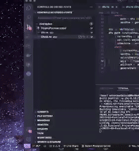

# Pacman

**Disciplina**: FGA0210 - PARADIGMAS DE PROGRAMAÇÃO - T01 <br>
**Nro do Grupo**: 03<br>
**Paradigma**: Funcional<br>

## Alunos

|Matrícula | Aluno |
| :--: | :--: |
| 20/2028211 |  [Antônio Aldísio](https://github.com/AntonioAldisio/) |
| 19/0026243 |  [Dafne Moretti Moreira](https://github.com/DafneM/) |
| 18/0122258 |  [Igor Queiroz Lima](https://github.com/igorq937/) |
| 19/0030879 |  [João Pedro Moura Oliveira](https://github.com/Joao-Moura/) |
| 17/0080102 |  [Lucas Gomes Lopes](https://github.com/LucasGlopes/) |
| 18/0114093 |  [Lucas Ursulino Boaventura](https://github.com/lboaventura25/) |
| 19/0019085 |  [Rafael Cleydson da Silva Ramos](https://github.com/RcleydsonR/) |
| 19/0020377 |  [Thiago Sampaio de Paiva](https://github.com/thiagohdaqw/) |


## Sobre
O projeto, como o próprio nome já diz, trata-se de um Pacman, em que o jogador deve coletar o máximo de moedas possíveis ao mesmo tempo que foge de seu inimigo mortal, os fantasmas. O motivo para a escolha desse tema, é em decorrência da complexidade por trás de toda a interface gráfica e dos algoritmos de busca em grafos. Portanto, como uma forma de se aprender uma linguagem funcional (haskell, nesse caso) e exercitar a lógica para resolução de problemas, esse trabalho foi concebido.<br>
A ideia do projeto é baseada do projeto final de um dos integrantes do grupo: [Labirinto do Hoglin](https://github.com/projeto-de-algoritmos/Final_LabirintoDoHoglin)

## Screenshots
<p>
    
    
</p>

## Instalação

**Linguagens**: haskell <br>
**Tecnologias**: GHCI, cabal e haskell <br>

## Pré-requisitos
### Haskell, GHCI e cabal

O haskell pode ser baixado em conjunto com o ghci (e o cabal) através dos links dispostos, ou através dos pacotes oficiais de cada distro, na página [oficial do haskell](https://www.haskell.org/downloads/)

## Uso

O uso do projeto é bem simples graças ao empacotador de dependências cabal, porém alguns problemas de compatibilidades podem surgir. Assim, é altamente recomendado utilizar ambiente linux.
```bash
# Atualizando o cabal
$ cabal update

# Iniciando o projeto
$ cabal run

# Realizar o load de todos os módulos sem iniciar a main
$ cabal repl
```

Após isso, a aplicação irá abrir e o jogo estará pronto para ser executado. Basta escolher o modo de jogo (solo ou difícil), onde no **solo** é possível escolher qual algorítmo o fantasma estará utilizando.<br>
Para se movimentar utilize as setinhas do teclado, e se divirta.

## Problemas de Compatibilidade Conhecidos

Durante o desenvolvimento da aplicação alguns problemas de compatibilidades dos módulos extras foram encontrados, a seguir se encontram algum deles descritos:
- **Problemas de versionamento entre os módulos**: A princípio esse problema foi corrigido com a sintaxe `modulo ==X.*`, porém, ainda assim podem ocorrer problemas. Caso isso aconteça, deve-se alterar o arquivo [ProjetoPacman.cabal](https://github.com/UnBParadigmas2022-1/2022.1_G3_Funcional_ProjetoPacman/blob/master/ProjetoPacman.cabal) na seguinte posição

```cabal
38    build-depends:
39        base ==4.*,
40        heap ==1.*,
- 41        gloss ==1.*,       <-- Ex.: gloss dando problemas de compatibilidade
+ 41        gloss ==1.1.5.2,
42        random ==1.*,
```

- **Problemas de compatibilidade com a biblioteca Random**: Foi evidênciado por alguns integrantes que ao dar o run no projeto com a biblioteca Random, existiam problemas no download da mesma. Portanto, para se resolver esse problema deve-se fixar a versão do random em uma versão compatível com a biblioteca ghc (tentativa e erro). Além disso, é necessário alterar o seguinte código do arquivo `app/Coins.hs`
```haskell
generateRandom :: StdGen -> (Int, Int) -> (Int, StdGen)
- generateRandom seed range = uniformR range seed
+ generateRandom seed range = randomR range seed
```

## Vídeo
Adicione 1 ou mais vídeos com a execução do projeto.
Procure:
(i) Introduzir o projeto;
(ii) Mostrar passo a passo o código, explicando-o, e deixando claro o que é de terceiros, e o que é contribuição real da equipe;
(iii) Apresentar particularidades do Paradigma, da Linguagem, e das Tecnologias, e
(iV) Apresentar lições aprendidas, contribuições, pendências, e ideias para trabalhos futuros.
OBS: TODOS DEVEM PARTICIPAR, CONFERINDO PONTOS DE VISTA.
TEMPO: +/- 15min

## Participações

|Nome do Membro | Contribuição | Significância da Contribuição para o Projeto (Excelente/Boa/Regular/Ruim/Nula) |
| :--:| :--: | :--: |
| Antonio Aldisio  |  Algoritmo Dfs | Regular |
| Rafael Ramos  | Algoritmo Bfs | Boa |
| Thiago Paiva  |  Menu, Modos de jogo e Mapa | Excelente |
| João Pedro Moura | Algoritmo A*, Fluxo com a Tela Final e Colisões do player | Excelente |
| Lucas Gomes | Algoritmo de Djikstra | Boa |
| Lucas Boaventura | Módulo de Moeda (Draw/Update) e pontuação | Boa |
| Dafne Moretti | Módulo de Ghosts (Draw/Update) e slow | Boa |
| Igor Lima | Módulo do Player (Draw/Update/Input) | Boa |

## Outros
### Lições Aprendidas

Haskell é estaticamente tipado. Quando compila o programa, o compilador saberá quais partes do código é um número, o que é uma string e assim por diante. Ou seja, uma série de erros pode ser capturada em tempo de compilação. Se você tentar adicionar um número a uma string, o compilador irá se queixar de você.

O Haskell é fortemente tipado e foi bastante trabalhoso sempre que precisava resolver conflitos ao realizar um merge entre branches. É importantíssimo que a pessoa que estava trabalhando em uma branch mantesse ela o mais atualizada possível com a master.

### Contribuições e Fragilidades

O projeto apresentada uma fragilidade no algoritmo Dfs (Depth-first search), pois ele não está adaptado corretamente. Como o DFS retorna o primeiro caminho que ele encontra e o grafo do mapa é circular e fechado, então o fantasma sempre vai para a primeira célula que ele analisa, impossibilitando a perseguição. Para resolver esse problema, teria que implementar estratégias para limitar a profundeza da análise de cada célula, que são complexas e levaria mais tempo do que o planejado. O problema pode ser visto no gif abaixo:

<p>

</p>

###  Melhorias Futuras do Trabalho
Diversas alterações e melhorias ainda podem ser feitas, e a equipe separou algumas interessantes:

- Novas implementações de algoritmos de busca, diversificando a movimentação dos fantasmas.
- Geração aleatória e automática de fases e labirintos (mapa).
- Adição do super poder do Pacman e rotas de fuga dos fantasmas. Exemplo: Possibilidade de "comer" o fantasma.
- Adição de estratégias mais complexas de perseguição. 
- Adaptação da implementação do Dfs.
- Inclusão de diferentes pontuações para as moedas e novos modos de jogo.

## Fontes

- Inpirado em: Labirinto do Hoglin. Disponível em: <https://github.com/projeto-de-algoritmos/Final_LabirintoDoHoglin>

- Kurt, W., 2018. Get programming with Haskell. Oreilly. Disponível em: <https://oreilly.com/library/view/get-programming-with/9781617293764/kindle_split_001.html>

- Learn You a Haskell for Great Good! Disponível em: <http://learnyouahaskell.com/chapters>

- Aprenda um Haskell para um grande bem!. Disponível em: <https://github.com/taylorrf/learnhaskell>
